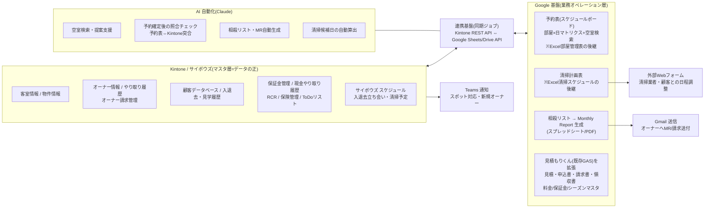
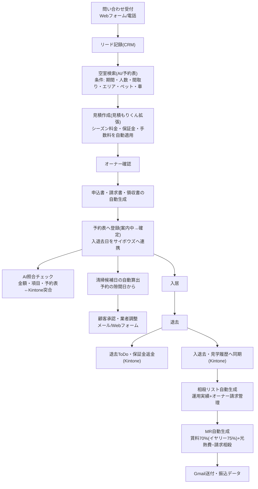

# システム概要設計(ドラフト v0.2)

作成日: 2026-08-19(v0.2: ヒアリング資料の内容を反映)
前提: `docs/requirements/01_方針_プラットフォーム構成.md` の決定事項に基づく。

- Kintone = マスタ(データベースの正)
- Excel・外部帳票 → Google ベースの仕組みへ集約
- Kintone API で Google 側と連携
- AI(Claude)による自動化を業務ごとに積み重ねる(2026-07 会議合意)

## 1. 全体アーキテクチャ



### 各層の役割分担

| 層 | 役割 | データ |
|---|---|---|
| Kintone/サイボウズ(マスタ層) | マスタと確定レコードの正。利用中12アプリを維持しつつ段階的に整備 | 客室・物件・オーナー・顧客・入退去履歴・保証金・オーナー請求・RCR・ToDo |
| Google(オペレーション層) | 日々の運用画面と帳票。Excel 4種(予約表/清掃計画表/MR/相殺リスト)を置き換え | 予約・滞在予定(未来)・清掃計画・相殺リスト・MR・見積/請求書 |
| AI(自動化層) | 検索・照合・帳票生成など判断を伴う作業の自動化 | — |
| 連携基盤 | 双方向同期+突合検証。Kintone REST API + Google Sheets/Drive/Gmail API | 同期ログ・不一致リスト |

### 既存資産の活用と移行対象

| 現行 | 扱い |
|---|---|
| Excel 予約表(部屋×日、コード30/40/50) | Google 予約表へ移行(Phase 1)。「未来の滞在予定」の正となる |
| Excel 清掃計画表 | Google 清掃計画へ移行し予約表と連動(Phase 2) |
| Excel 相殺リスト+MR(田中さんへ委託) | 予約表+オーナー請求管理アプリから自動生成(Phase 1) |
| 見積もりくん(GAS。部屋/シーズン料金/保証金マスタを保有) | 料金計算エンジンとして拡張。申込書・請求書・領収書の発行まで担う(Phase 2) |
| Kintone 未利用アプリ(請求書・カギ貸出返却・在庫管理等) | 新規開発前に活用可否を判断(安易に増やさない) |
| Word 申込書(都度手作成) | 見積もりくん拡張で自動生成へ |

## 2. データモデル概要

現行 Kintone の結合キー(施設名&部屋番号、宿泊者氏名)を活かしつつ、
予約表(Google)側に「未来の滞在予定」を持たせ、確定・完了したものを Kintone 履歴へ反映する。

```mermaid
erDiagram
    OWNER["オーナー情報(Kintone)"] ||--o{ ROOM : "施設名"
    ROOM["客室情報(Kintone)"] ||--o{ STAY_PLAN : "施設名&部屋番号"
    ROOM ||--o{ CLEANING : "施設名&部屋番号"
    ROOM ||--o{ PRICE["料金マスタ(基本料金/清掃費/家賃)"] : ""
    SEASON["シーズン料金マスタ(冬期/ピーク/トップ)"] ||--o{ QUOTE : "期間適用"
    PRICE ||--o{ QUOTE["見積(見積もりくん)"] : ""
    QUOTE ||--o| STAY_PLAN : "成約時"
    STAY_PLAN["予約・滞在予定(Google予約表)"] ||--o| STAY_HISTORY : "確定・完了時に同期"
    STAY_HISTORY["入退去・見学履歴(Kintone)"] }o--|| CUSTOMER : "宿泊者氏名"
    CUSTOMER["顧客データベース(Kintone)"] ||--o{ DEPOSIT : "履歴レコード"
    DEPOSIT["保証金管理(Kintone)"]
    STAY_PLAN ||--o{ CLEANING : "退去日→清掃候補日"
    STAY_PLAN ||--o{ OFFSET : "運用実績"
    OWNERBILL["オーナー請求管理(Kintone)"] ||--o{ OFFSET : "立替・請求分"
    OFFSET["相殺リスト(Google)"] ||--o{ MR : "月次集計"
    OWNER ||--o{ MR : "宛先・分配率(70%/75%)"
    MR["Monthly Report(Google生成)"]
    CLEANING["清掃計画(Google)"]
```

- 予約表のセル値は現行 Excel のコード(30=マンスリー/40=長期/50=オーナー利用)を
  「滞在区分+料金区分(レギュラー/冬期/ピーク/トップ)+期間」のレコードに正規化する
- 「案内中(仮押さえ)」ステータスを正式に持たせ、ダブルブッキング対策を仕組み化する
- 表記ゆれ対策として、施設名&部屋番号・顧客氏名の突合を同期ジョブで検証し、不一致は AI 照合でリストアップ

## 3. 主要業務フロー(To-Be)

### 予約〜精算の全体フロー



### MR 作成の As-Is → To-Be

| | As-Is | To-Be |
|---|---|---|
| 元データ | 予約表から関数で手作成(Kintone非保管) | 予約表(Google)の滞在レコードから自動集計 |
| 相殺リスト | 予約表目視+オーナー請求管理アプリの2系統を手動転記、色分け(ピンク=未相殺/黄=反映済) | 2系統を自動統合、ステータスをデータとして管理 |
| レポート作成 | 外部委託(田中さん)が Excel で作成・請求書発行 | テンプレートから自動生成(PDF/スプレッドシート)、人は確認のみ |
| 工数 | リードタイム10日・相殺リスト16時間/月 | 大幅短縮(目標: 1営業日以内・確認1〜2時間) |

## 4. フェーズ別ロードマップ(案)

| フェーズ | 時期(案) | スコープ | 対応課題 |
|---|---|---|---|
| Phase 1 | 8〜9月 | ①予約表の Google 移行(部屋×日ボード+案内中ステータス+空室検索) ②相殺リスト自動生成→MR 自動生成プロトタイプ | No.3, 10, 11 |
| Phase 2 | 10〜11月 | ③清掃計画の連動(候補日自動算出・顧客承認・業者調整フォーム) ④見積もりくん拡張(申込書・請求書・領収書) ⑤照合チェック自動化 | No.4, 5, 6 |
| Phase 3 | 12月〜 | ⑥リード管理・CRM/タスク可視化(複数名進行) ⑦保証金返金フロー・新規オーナー対応・車両管理 ⑧空室検索チャットボット公開 | No.1, 2, 7, 8, 9 |
| 将来 | 来期以降 | 民泊対応(OTA連携・ダイナミックプライシング)、3000室スケール検証 | — |

Phase 1 が最優先である根拠: MR 作成は月16時間+リードタイム10日(定量効果が最大)、
予約表は全業務のハブ(清掃・RCR・相殺・MRすべてが予約表を参照)であり他フェーズの前提となるため。

## 5. 未確定事項(要ディスカッション)

1. **予約表の実装形態**: スプレッドシート+GAS で始めるか、専用 Web アプリ(部屋×日ボードの操作性が高い)か。
   → 推奨: Phase 1 はスプレッドシート+GAS で速く出し、限界が見えたら Web アプリ化
2. **見積もりくんの稼働状況**: システム一覧では「利用中」、ヒアリングメモでは「まだ稼働していない」。
   現状の利用実態と拡張の土台にできるかを確認したい
3. **田中さん(外部委託)の役割**: MR 自動化後は「作成」から「確認」へ移行するのか、委託を終了するのか
4. **サイボウズ スケジュールの位置づけ**: 入退去・清掃の予定をサイボウズに転記する運用を残すか、
   Google 予約表からの自動連携(またはGoogleカレンダー移行)にするか
5. **同期の方向と頻度**: どのデータをどちらを正として、リアルタイム/日次いずれで同期するか
6. **アカウント・権限設計**: Google Workspace / Kintone API トークンの管理方針

### 解消済み(v0.1 → v0.2)

- ~~MR の入力データの所在~~ → 予約表から関数で作成、Kintone 非保管(ヒアリング資料で判明)
- ~~「物件情報」アプリの役割~~ → 新規オーナー契約時に客室情報・オーナー情報とともに登録して使用
