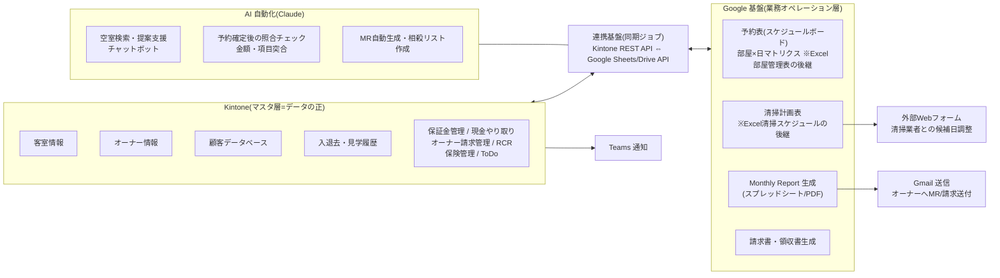
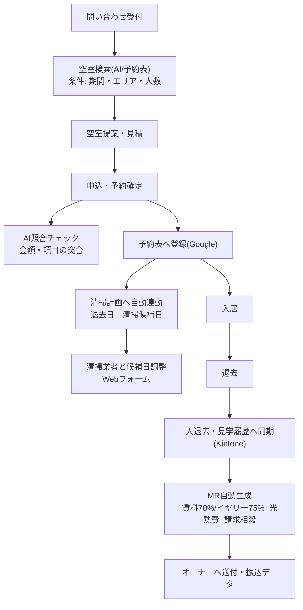

# システム概要設計(ドラフト v0.1)

作成日: 2026-08-19
前提: `docs/requirements/01_方針_プラットフォーム構成.md` の決定事項に基づく。

- Kintone = マスタ(データベースの正)
- Excel・外部帳票 → Google ベースの仕組みへ集約
- Kintone API で Google 側と連携
- AI(Claude)による自動化を業務ごとに積み重ねる(2026-07 会議合意)

## 1. 全体アーキテクチャ



### 各層の役割分担

| 層 | 役割 | データ |
|---|---|---|
| Kintone(マスタ層) | マスタと確定レコードの正。現行アプリ構成を維持しつつ段階的に整備 | 客室・オーナー・顧客・入退去履歴・保証金・請求・ToDo |
| Google(オペレーション層) | 日々の運用画面と帳票。Excel を置き換える | 予約表(未来の滞在予定)・清掃計画・MR・請求書 |
| AI(自動化層) | 検索・照合・帳票生成など判断を伴う作業の自動化 | — |
| 連携基盤 | 双方向同期。Kintone REST API + Google Sheets/Drive/Gmail API | 同期ログ・エラー通知 |

## 2. データモデル概要

現行 Kintone の結合キー(施設名&部屋番号、宿泊者氏名)を活かしつつ、
予約表(Google)側に「未来の滞在予定」を持たせ、確定・完了したものを Kintone 履歴へ反映する。

```mermaid
erDiagram
    OWNER["オーナー情報(Kintone)"] ||--o{ ROOM : "施設名"
    ROOM["客室情報(Kintone)"] ||--o{ STAY_PLAN : "施設名&部屋番号"
    ROOM ||--o{ CLEANING : "施設名&部屋番号"
    STAY_PLAN["予約・滞在予定(Google予約表)"] ||--o| STAY_HISTORY : "確定・完了時に同期"
    STAY_HISTORY["入退去・見学履歴(Kintone)"] }o--|| CUSTOMER : "宿泊者氏名"
    CUSTOMER["顧客データベース(Kintone)"] ||--o{ DEPOSIT : "履歴レコード"
    DEPOSIT["保証金管理(Kintone)"]
    STAY_PLAN ||--o{ CLEANING : "退去日→清掃予定"
    STAY_HISTORY ||--o{ MR : "月次集計"
    OWNER ||--o{ MR : "宛先・分配率"
    MR["Monthly Report(Google生成)"]
    CLEANING["清掃計画(Google)"]
```

- 予約表のセル値は現行 Excel のコード(30=マンスリー/40=長期/50=オーナー利用)を
  構造化した「滞在区分+料金区分(レギュラー/冬期/ピーク/トップ)+期間」のレコードに正規化する
- 表記ゆれ対策として、施設名&部屋番号・顧客氏名の突合を同期ジョブで検証し、不一致は AI 照合でリストアップ

## 3. 主要業務フロー(To-Be)



## 4. フェーズ別ロードマップ(案)

| フェーズ | 時期(案) | スコープ | 対応する課題(2025-12資料) |
|---|---|---|---|
| Phase 1 | 8〜9月 | ①予約表の Google 移行(部屋×日ボード+空室検索) ②MR 自動生成プロトタイプ(相殺リスト含む) | No.3, 10, 11 |
| Phase 2 | 10〜11月 | ③清掃計画の連動・業者調整フォーム ④申込〜請求書/領収書発行 ⑤照合チェック自動化 | No.4, 5, 6 |
| Phase 3 | 12月〜 | ⑥リード管理・CRM/タスク可視化 ⑦保証金返金フロー・車両管理 ⑧チャットボット公開 | No.1, 2, 7, 8, 9 |
| 将来 | 来期以降 | 民泊対応(OTA連携・ダイナミックプライシング)、3000室スケール検証 | — |

Phase 1 が最優先である根拠: MR 作成は月16時間+リードタイム10日(定量効果が最大)、
予約表は全業務のハブであり他フェーズの前提となるため。

## 5. 未確定事項(要ディスカッション)

1. **予約表の実装形態**: Google スプレッドシート+GAS で始めるか、
   Google 基盤(Apps Script Web アプリ or Cloud Run)上の専用 Web アプリとするか。
   → 推奨: Phase 1 はスプレッドシート+GAS で速く出し、操作性の限界が見えたら Web アプリ化
2. **同期の方向と頻度**: どのデータをどちらを正として、リアルタイム/日次いずれで同期するか
3. **MR の入力データ**: 現行 MR 作成時の元データ(滞在実績・光熱費・請求項目)がどこにあるかの確認
4. **「物件情報」アプリの役割**(現行構成で独立している)
5. **アカウント・権限設計**: Google Workspace / Kintone API トークンの管理方針
