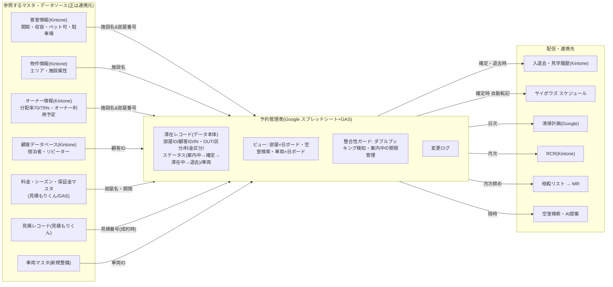

# 予約管理表 システム関連図(Phase 1 設計)

作成日: 2026-08-19
Excel 部屋管理表の後継「予約管理表」(Google スプレッドシート+GAS)が参照するデータソースと配信先の整理。
予約管理表は**「未来の滞在予定」の正**。マスタの正は Kintone・見積もりくん側に置いたまま読み取り連携する。

## 関連図

## 参照するデータソース(入力)

| 連携元 | キー | 予約管理表での役割 | 同期 |
|---|---|---|---|
| 客室情報(Kintone) | 施設名&部屋番号 | ボードの行(部屋軸)。間取・収容・受入条件を検索フィルタに使用 | 日次配信 |
| 物件情報(Kintone) | 施設名 | エリア・施設属性(検索フィルタ) | 日次配信 |
| オーナー情報(Kintone) | 施設名&部屋番号 | 分配率(70%/イヤリー75%)引当、オーナー利用予定の登録元 | 日次配信 |
| 顧客データベース(Kintone) | 顧客ID(宿泊者氏名) | 滞在レコードと宿泊者の紐付け、リピーター判定 | 日次配信 |
| 料金・シーズン・保証金マスタ(見積もりくん) | 部屋名+期間 | 単価・シーズン区分(色分け)・保証金/手数料ルール | 変更時配信 |
| 見積レコード(見積もりくん) | 見積番号 | 成約時に滞在レコードを自動生成 | 成約時 |
| 車両マスタ(新規整備) | 車両ID | 車両×日ボード(車用予約表)の行 | 日次配信 |

## 配信先(出力)

| 連携先 | タイミング | 渡す内容 | 置き換える現行作業 |
|---|---|---|---|
| 入退去・見学履歴(Kintone) | 予約確定時・退去完了時 | 滞在レコードの実績書き戻し | Kintone手入力・突き合わせ |
| サイボウズ スケジュール | 予約確定時 | 入居日・退去日の立ち会い予定 | 手転記 |
| 清掃計画(Google、Phase 2) | 日次 | 退去日→次入居日の清掃可能日候補 | 毎月25日の目視の隙間日探し |
| RCR(Kintone) | 月次 | 空室期間の巡回対象リスト | 予約表とRCRアプリの目視突合 |
| 相殺リスト→MR | 月次締め | 部屋×月の区分別日数・単価・光熱費日数 | 相殺リスト手作成16時間/月 |
| 空室検索・AI提案 | 随時 | 条件(期間・人数・間取・エリア・ペット・車)での空室クエリ | 1件10〜60分の目視物件探し |

## 設計上のポイント

1. **キーは内部IDで持ち、表示名との対応表を分離** — 「施設名&部屋番号」「宿泊者氏名」は表記ゆれに弱いため、
   内部では部屋ID・顧客ID・滞在IDを採番し、Kintone表示名とのマッピングシートを1枚だけ持つ。
   不一致は同期ジョブが検出し AI 照合で候補提示。
2. **「レコードが正、ボードは描画」** — 滞在レコード(1予約=1行)を正とし、部屋×日ボードは自動描画。
   見た目は現行の色分けを再現して現場の移行負担を抑える。
3. **車両マスタは台帳が存在しない**(課題No.9)— Phase 1 では最低限の車両リストをシートで作り、将来 Kintone アプリ化。
4. **「案内中」を正式なステータスに** — 仮押さえに有効期限を持たせ、期限切れは自動で空室へ戻す(ダブルブッキング対策の仕組み化)。
